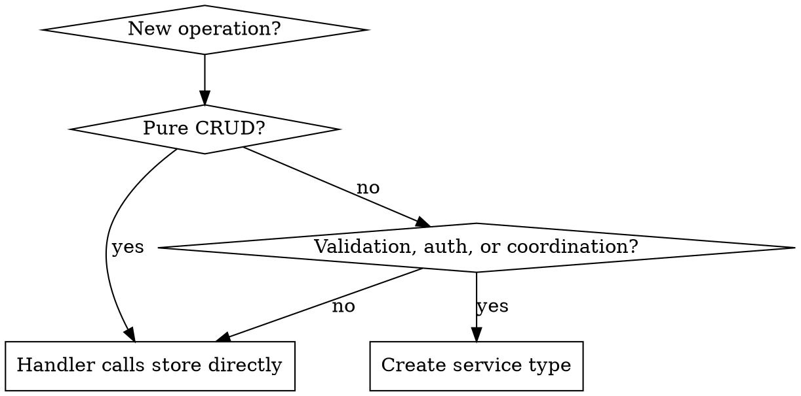

# Go Service Architecture

Hexagonal architecture for Go microservices with dual database support, REST APIs, and MCP integration.

**Core invariant:** The `domain/` package has zero infrastructure dependencies — stdlib only. All infrastructure lives in `infra/`. This separation is non-negotiable.

## Project Layout

```
cmd/
  daemon/         -- HTTP server, systemd service
  mcp-bridge/     -- stdio-to-HTTP MCP bridge
  admin/          -- CLI admin commands (seed, migrate, export/import)
internal/
  config/         -- XDG paths, koanf config loading
  domain/         -- Core types, port interfaces, error sentinels
  infra/
    sqlite/       -- SQLite store + Goose migrations
    postgres/     -- PostgreSQL store + Goose migrations
    httpapi/      -- REST API handlers
    mcp/          -- MCP tool handlers
main.go
mise.toml
```

No `pkg/` directory — use `internal/` or flat layout.

## Library Stack

| Concern | Library |
|---------|---------|
| CLI | `spf13/cobra` |
| Config | `knadh/koanf` |
| Logging | `log/slog` (stdlib) |
| HTTP mux | `net/http` (stdlib) |
| REST | `danielgtaylor/huma/v2` |
| SQLite | `modernc.org/sqlite` (CGO-free) |
| PostgreSQL | `jackc/pgx/v5` |
| Migrations | `pressly/goose/v3` |
| Background queue | `maragu.dev/goqite` |
| MCP | `mark3labs/mcp-go` |
| UUID | `google/uuid` |
| CEL expressions | `google/cel-go` |
| Linter | `golangci-lint` |
| Build tooling | `mise` |

All permissively licensed — no GPL/LGPL/AGPL.

## Architectural Rules

1. **Dependency direction is always inward.** Domain imports nothing from infra. Infra imports domain. Handlers import domain ports.
2. **Port interfaces live in `domain/`.** Implementations live in `infra/`. Consumers accept the narrowest interface they need (`HealthChecker`, not `Store`).
3. **Keep ports small.** 5-7 methods max. Split when they grow.
4. **Don't split `domain/` into sub-packages.** One flat package avoids circular imports between entity types and port interfaces. Split across files by concern (`store.go`, `identity.go`, `chat.go`).
5. **Simple CRUD skips the service layer.** Handler calls store directly. Introduce a service type only when business logic emerges (validation, authorization, cross-entity coordination).
6. **Context propagation everywhere.** Every port method takes `ctx context.Context` as first parameter. Never store contexts in structs. Never use `context.Background()` in request-handling code.
7. **IDs generated at infra layer.** Domain uses plain `string` for ID fields. Infra generates prefixed UUIDs: `prefix_<uuid>`.
8. **Error sentinels in domain, wrapping in infra.** Domain defines `ErrNotFound`, `ErrAlreadyExists`, etc. Infra wraps with `fmt.Errorf("get entity %s: %w", id, err)`. Callers check with `errors.Is`.
9. **Business logic never in handlers or stores.** Handlers handle HTTP concerns. Stores do CRUD. Logic goes in the service layer.
10. **Cross-cutting concerns via middleware and context.** Auth, logging, tracing, rate limiting wrap the mux. Domain ports stay pure.

## When to Add a Service Layer



## Anti-Patterns

- **Importing infra from domain.** Dependency direction is always inward.
- **Passing `*sql.DB` through the domain.** Use port interfaces.
- **Business logic in handlers.** If a handler has an `if` that isn't about HTTP concerns, it belongs in a service.
- **Business logic in stores.** Validation, authorization, and coordination belong in the service layer.
- **Growing a port interface past 7 methods.** Split into focused interfaces.

## Implementation Reference

See @references/architecture-reference.md for full code examples covering:
- Domain types, error sentinels, and port interfaces
- SQLite and PostgreSQL store implementations
- HTTP server setup, route registration, and error mapping
- Middleware (request logging, panic recovery)
- MCP server integration
- CLI and config with Cobra + koanf
- Background queue with goqite
- Graceful shutdown
- Dockerfile and build tooling
- Testing patterns
